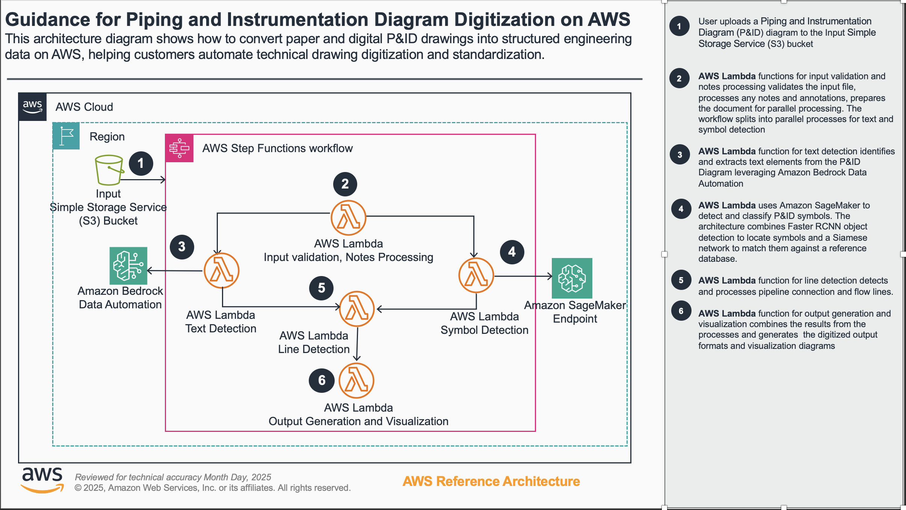

# P&ID Digitization Solution

A comprehensive AWS-based pipeline for processing Piping and Instrumentation Diagrams (P&IDs) using computer vision, OCR, and graph analysis to extract structured data from engineering drawings.

## Table of Contents

- [Overview](#overview)
- [Architecture](#architecture)
- [Quick Start](#quick-start)
- [Usage Examples](#usage-examples)
- [Output Structure](#output-structure)
- [Documentation](#documentation)
- [Cost](#cost)


## Overview

This pipeline processes P&ID diagrams through a series of automated steps:

1. **Input Validation** - Validates uploaded files and formats
2. **Notes Processing** - Removes notes sections and frames from diagrams
3. **Parallel Processing**:
   - **Text Detection** - Extracts text elements using Amazon Bedrock Data Automation
   - **Symbol Detection** - Identifies symbols using SageMaker endpoints
4. **Line Detection** - Detects connecting lines using computer vision
5. **Graph Generation** - Creates structured graph representation
6. **Visualization** - Generates visualization outputs

## Architecture



## Quick Start

### Prerequisites

- AWS CLI configured with appropriate permissions
- Node.js 18+ and npm
- Python 3.13+
- CDK CLI installed (`npm install -g aws-cdk`)

### Basic Deployment

1. **Clone and install dependencies**:
   ```bash
   git clone <repository-url>
   cd cognite/cdk
   npm install
   pip install -r requirements.txt
   ```

2. **Build the project**:
   ```bash
   npm run build
   ```
   This step is **required** - it syncs shared utilities between Lambda functions and compiles TypeScript.

3. **Bootstrap CDK (first time only)**:
   ```bash
   cdk bootstrap
   ```

4. **Configure infrastructure**:
   ```bash
   cp config.json.template config.json
   ```
   
   **Edit `cdk/config.json` with your AWS settings:**
   
   ```json
   {
     "vpc": {
       "vpcId": "vpc-0707a2051b2e94275",           // Your VPC ID (required)
       "subnetIds": ["subnet-xxx", "subnet-yyy"],   // Private subnets in different AZs (required)
       "createVpcEndpoints": true                   // Recommended for security
     },
     "endpoints": {
       "sagemaker": true,    // Required for symbol detection
       "bedrock": true,      // Required for text detection  
       "logs": true          // Recommended for performance
     },
     "model": {
       "s3Uri": "s3://your-bucket/path/to/model.tar.gz"  // Required: trained model location
     }
   }
   ```
   
   **Required Configuration Steps:**
   
   - **VPC ID**: Find your VPC ID in AWS Console → VPC → Your VPCs
   - **Subnet IDs**: Use private subnets in different Availability Zones
   - **Model S3 URI**: Upload your trained SageMaker model to S3 and provide the URI

5. **Deploy infrastructure**:
   ```bash
   # Deploy with default name (PNIDDigitization)
   cdk deploy

   # Or deploy with custom name
   export CDK_STACK_NAME="your-custom-name"
   cdk deploy
   ```

6. **Process an image**:
   ```bash
   # Upload image to input bucket
   aws s3 cp your-pnid.png s3://your-input-bucket/
   
   # Or manually execute Step Functions
   aws stepfunctions start-execution \
     --state-machine-arn <your-state-machine-arn> \
     --input '{"image_key": "your-pnid.png", "input_bucket": "your-input-bucket", "processing_config": {}}'
   ```

## Usage Examples

### Basic Processing
```json
{
  "image_key": "diagrams/pnid-001.png",
  "input_bucket": "my-pnid-bucket",
  "processing_config": {}
}
```

### Custom Line Detection
```json
{
  "image_key": "complex-diagram.png",
  "input_bucket": "my-bucket",
  "processing_config": {
    "line_detection": {
      "threshold": 5,
      "postprocess_params": {
        "merge_distance_threshold": 0.015
      }
    }
  }
}
```

### Manual Coordinates Processing
```json
{
  "image_key": "diagram-with-notes.png",
  "input_bucket": "my-bucket",
  "processing_config": {
    "notes_processing": {
      "manual_coordinates": {
        "x": 100, "y": 50, "width": 800, "height": 600
      }
    }
  }
}
```

For more examples and detailed parameter explanations, see the [Configuration Guide](docs/CONFIGURATION.md).

## Output Structure

### S3 Organization
Results are organized by execution ID for traceability:

```
s3://output-bucket/
└── {execution-id}/
    ├── config/
    │   └── processing_config.json          # Validated processing configuration
    ├── input/
    │   └── original_image.png              # Copy of input file for reference
    ├── notes-processing/
    │   ├── processed_image.png             # Image after notes/frame removal
    │   └── notes_metadata.json            # Notes processing metadata
    ├── text-detection/
    │   ├── text_detection_results.json    # Text elements with coordinates
    │   ├── debug_image.png                # Debug image with text annotations
    │   └── bda_output/                     # Bedrock Data Automation outputs
    ├── symbol-detection/
    │   ├── detections.json                # Symbol detection results
    │   ├── debug_image_labeled.png        # Debug image with class labels
    │   └── debug_image_boxes.png          # Debug image with boxes only
    ├── line-detection/
    │   ├── lines.json                      # Line segments and intersections
    │   └── debug/                          # Debug images (if enabled)
    ├── graph/
    │   ├── graph_data.json                 # Final graph structure
    │   └── dexpi_output.xml                # DEXPI format output
    ├── visualization/
    │   ├── physical_layout.png             # Physical layout visualization
    │   └── graph_representation.png       # Graph network visualization
    └── execution_metadata.json            # Execution metadata and paths
```

### Key Output Formats

**Graph Data Structure**:
```json
{
  "symbols": [{"id": "1", "type": "pump", "bbox": [245, 156, 290, 199]}],
  "lines": [{"id": "45", "points": [[245, 178], [456, 178]]}],
  "junctions": [{"id": "3", "point": [456, 178], "junction_type": "t_junction"}],
  "connections": [{"from": "symbol-1", "to": "line-45"}],
  "graph_stats": {"num_nodes": 224, "num_edges": 312}
}
```

**DEXPI Output**: Industry-standard XML format for engineering software integration

For complete data format specifications, see the [API Reference](docs/API_REFERENCE.md).

## Documentation

### Detailed Guides

- **[Configuration Guide](docs/CONFIGURATION.md)** - Detailed parameter explanations and tuning guide
- **[API Reference](docs/API_REFERENCE.md)** - Lambda functions, data formats, and S3 organization
- **[Troubleshooting Guide](docs/TROUBLESHOOTING.md)** - Common issues and solutions
- **[Shared Files Automation](docs/shared-files-automation.md)** - Development workflow documentation

### Getting Help

For issues and questions:
- **Check [Troubleshooting Guide](docs/TROUBLESHOOTING.md)** for common solutions
- **Review CloudWatch logs** for detailed error information  
- **Test with simplified configurations** to isolate issues
- **Create an issue** in the repository with complete error details

### Development

For development workflow and shared utilities management, see [Shared Files Automation](docs/shared-files-automation.md).

### Contributing

1. Fork the repository
2. Create a feature branch
3. Make changes and test thoroughly
4. Update documentation as needed
5. Submit a pull request


## Cost
Note that these prices vary over time, these estimates are based on at the time of development of the project.
The cost for this solution primarily comes from two main components: the Inference Endpoint and the Processing Pipeline.

### Inference Endpoint

The Inference Endpoint is the primary cost driver for this solution. It uses an ml.g6.2xlarge instance, which has the following pricing options:

- On-Demand: $879/month
- Capacity Reservation: $323/month

### Processing Pipeline Costs (100 P&IDs/month)

The processing pipeline includes several AWS services. Here's a breakdown of the estimated monthly costs for processing 100 P&IDs per month:

| Service | Usage Pattern | Monthly Cost (USD) | Scaling Factor |
|---------|---------------|---------------------|----------------|
| Amazon Bedrock | OCR processing | $105 | Linear with document volume |
| AWS Step Functions | State transitions | Free tier | Minimal until high volume |
| AWS Lambda | Few invocations | $0.20 | Negligible cost |

### Additional Costs

- **Training Sessions**: $44 per session (assuming 6-hour duration) using an ml.g6.2xlarge instance.
- **Model Storage**: $3/month for 30GB GP2 storage.


## License

This project is licensed under the Amazon Software License (ASL).
